<div align="center">


# artful-drawing

### drawing is easier than you think.

A free drawing studio that runs in your browser. Follow a guided drawing step by step,<br>
doodle with a pen that draws in perfect symmetry, color in a coloring page, trace over a photo,<br>
or build anything from simple shapes.<br>
**No drawing skills, no sign-up, nothing to install.** Just a keyboard and a mouse.

[**✏️ Start drawing**](https://normansrule.github.io/artful-drawing/studio.html) ·
[**🦋 Draw along**](https://normansrule.github.io/artful-drawing/studio.html#guide=butterfly) ·
[**✨ Doodle with the pen**](https://normansrule.github.io/artful-drawing/studio.html#start=pen) ·
[**🪣 Color it in**](https://normansrule.github.io/artful-drawing/studio.html#color=butterfly) ·
[**🏠 Website**](https://normansrule.github.io/artful-drawing/) ·
[**📖 Learn**](https://normansrule.github.io/artful-drawing/learn.html)

[](https://github.com/Normansrule/artful-drawing/actions/workflows/test.yml)


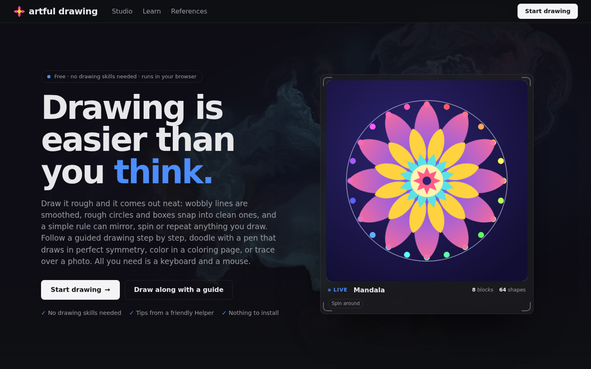

</div>

---

## 🖌 You draw. It helps.

<table>
<tr>
<td width="50%" valign="top">

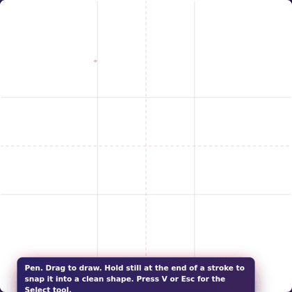

</td>
<td width="50%" valign="top">

**Draw it rough, it comes out neat.** Like the helpers in professional painting apps, the tools stay out of the way until they are useful:

- **Snap shapes:** hold still at the end of a stroke and a rough circle, oval, box, triangle, polygon, **star** or straight line becomes a clean one. Keep moving and it doesn't. Undo gives you back your own line.
- **Steady hand:** a lazy-string smoother ignores small wobbles as you draw.
- **Six brushes:** brush (thick and thin), ink, marker, pencil, neon and dots. Drawing tablets use real pen pressure; with a mouse, speed sets the thickness.
- **Symmetry:** mirror or spin every line you draw, up to 12 ways.
- **Layer effects:** one click adds a glow, a white sticker edge, a drop shadow, a long shadow or soft focus to any part.
- **Zoom and pan:** pinch or `Ctrl`+scroll to zoom in on details, and hold `Space` and drag to look around.
- **Color picker:** hold `Alt` and click to borrow any color, and your recent colors stay one click away.
- **Eraser, bucket, layers, 150 undos.** Everything you draw stays editable.

</td>
</tr>
<tr>
<td width="50%" valign="top">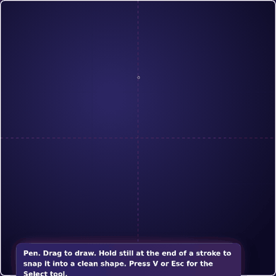</td>
<td width="50%" valign="top">

**Make it pop.** Every part has a one-click **Effect**:

| Effect | Looks like |
|---|---|
| Glow | a soft neon halo in the part's own color |
| Sticker | a thick white edge with a little shadow, like a die-cut sticker |
| Drop shadow | the part floats above the page |
| Long shadow | a flat, retro shadow down and to the right |
| Soft focus | gently blurred, for backgrounds and depth |

</td>
</tr>
<tr>
<td colspan="2">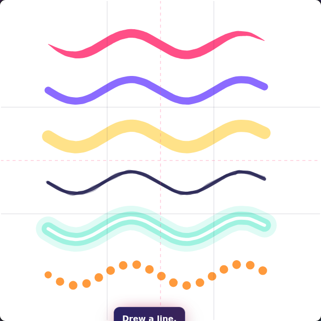</td>
</tr>
</table>

## 💡 The Helper: a friendly art teacher

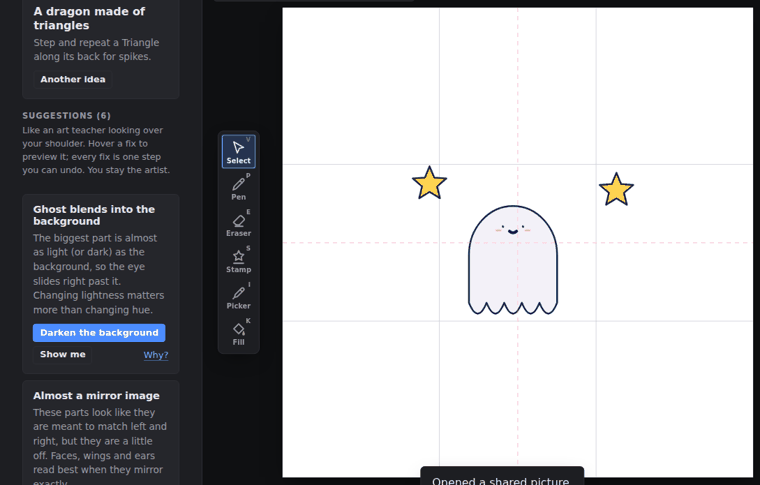

Open the **Helper** tab while you draw. It looks at your drawing the way an art teacher would, explains each idea in one sentence, and offers a **one-click fix** you can preview by hovering. Every fix is a normal step you can undo, and the Helper never adds anything you didn't draw.

| The Helper notices… | …and offers to | The art idea behind it |
|---|---|---|
| The drawing is tiny on the page | Make it bigger | A confident subject fills about half the canvas |
| It's *almost* centered | Center it exactly | Near-misses look like accidents |
| Parts just touch the edge | Add a margin | Negative space lets a picture breathe |
| The main part blends into the background | Darken or lighten the background | Value contrast matters more than hue |
| Too many unrelated colors | Harmonize colors | A few related colors look designed |
| Outlines of very different weights | Match them | One line weight means one style |
| Parts a few pixels from lining up | Line them up | Alignment reads as intention |
| Left and right parts that almost mirror | Make them match | Faces, wings and ears read best when symmetric |
| A face set high, or with small eyes, on a round body | Make it cuter | The "baby schema": big eyes, set low |
| A plain white page | Add a soft background tinted from your colors | A background frames and finishes the picture |
| A flat round shape | Add shading (shadow, highlight, crisp outline) | Light from one side makes shapes look solid |
| A character floating in mid-air | Add a ground shadow | A shadow anchors things to the ground |
| Parts completely off the page | Bring them back | Nobody can see them |

<table>
<tr>
<td width="40%">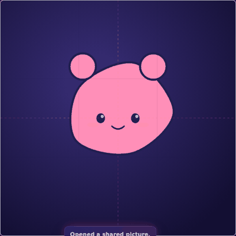</td>
<td width="60%" valign="top">

**✨ Add shading** turns a flat shape into a round one: a shadow on the lower right, a soft highlight on the upper left, and the outline redrawn crisp on top. It's all clipped inside the shape and grouped with it, so it moves together and stays editable. It's in the Helper and on every filled shape's settings.

**Put it on the ground** adds a soft oval shadow under a character so it stops floating.

</td>
</tr>
</table>

It also tells you **what's working** (strong contrast, a tidy palette, nice symmetry, good centering), and every tip links to the matching lesson on the Learn page.

## 🔤 Words and neat layouts

<table>
<tr>
<td width="45%" valign="top">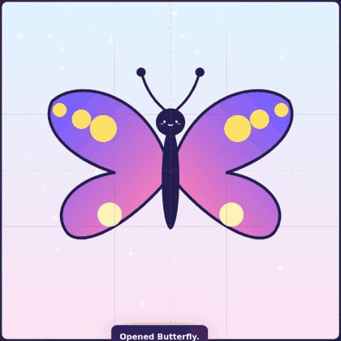</td>
<td width="55%" valign="top">

**Text** turns any drawing into a card, poster or label. Type straight into the settings panel (press Enter for a new line), then pick from six lettering styles: bold poster, rounded, handwritten, storybook serif, clean and typewriter. The outline gives sticker-style lettering, **Stretch to fill** fits the words to the box, and effects and repeats work on text too.

**Smart guides** appear while you drag. Pink lines show when a part's edge or middle lines up with another part or with the center of the page, and it snaps there. Hold `Alt` to drag freely.

Lettering only uses fonts that are already on people's computers, so exported pictures look the same everywhere.

</td>
</tr>
</table>

## 🎨 Change your mind as often as you like

<table>
<tr>
<td width="40%" valign="top">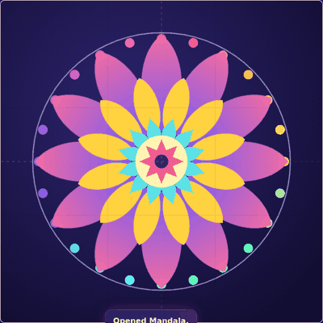</td>
<td width="60%" valign="top">

**✨ Recolor all.** Pick one color, pick a harmony (analogous, complementary, triadic, split or monochrome) and press **Recolor all**. Every color in your drawing changes, but each one keeps its lightness, so light stays light and dark stays dark. It's the same idea as "recolor artwork" in professional design apps.

**🕘 History.** Every step you take is listed by name ("Added Heart", "Snapped into a clean star", "Aligned 3 parts"). Click any step to jump back to it, then forward again.

**🔲 Select several parts.** Drag a box on the empty paper, `Shift`+click parts, or press `Ctrl+A`. Then move, nudge, duplicate or delete them together, and use **Align** to line them up or space them evenly.

**📐 Any canvas shape.** Square, poster (3:4), card (5:7), landscape (4:3), desktop (16:9) or phone wallpaper (9:16). Your drawing stays centered when you switch.

**🏷 Stickers.** *Download sticker* saves a PNG with a see-through background, ready for chat apps, slides and printable sticker paper.

</td>
</tr>
</table>

## ✏️ Four easy ways to draw

<table>
<tr>
<td width="33%" valign="top">

### 1 · Draw along

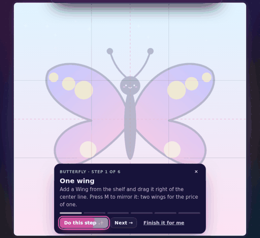

Pick one of **7 guided drawings**. A faint copy of the finished picture sits on the canvas like tracing paper. Each step tells you what to do, and a **Do this step ✨** button does it for you if you get stuck.

</td>
<td width="33%" valign="top">

### 2 · Doodle with the pen

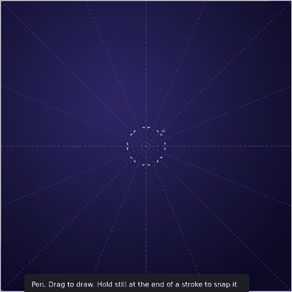

Press **P** and draw. Every line is mirrored or spun up to 12 ways. Close a loop and it fills with color. Wobbly hands come out smooth, and every stroke stays editable.

</td>
<td width="33%" valign="top">

### 3 · Build with shapes


Stack **31 shapes**, then add a rule: mirror, spin, step, grid, scatter or spiral. Press **Bloom** to watch any picture build itself, and save it as a video.

</td>
</tr>
<tr>
<td width="33%" valign="top">

### 4 · Color it in

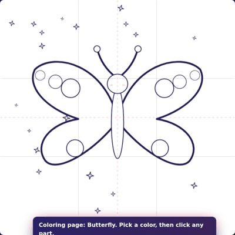

Every picture is also a **coloring page**. Pick a color, click a part, done. Click the empty paper to color the background. The easiest way for little artists to make something beautiful.

</td>
<td width="67%" colspan="2" valign="top">

### Little helpers that make it easier

| Helper | What it does |
|---|---|
| **📷 Trace a photo** | Put any photo over the canvas like a lightbox, then draw over it with the pen. The photo is never saved or exported. You can also drop an image straight onto the canvas. |
| **🪣 Paint bucket** (`K`) | Click any part to color it. Lines get a new line color; shapes get a new fill. |
| **🎨 Quick colors** | Ten ready-made colors beside the pen, one click each. |
| **🖼 My drawings** | Keep up to 30 drawings in your browser, with thumbnails, and reopen them any time. |
| **👻 Tracing paper** | In Draw along, the parts you haven't drawn yet show faintly where they belong. |
| **↩️ Undo everything** | 150 steps of undo, and your drawing saves itself as you go. |

</td>
</tr>
</table>

## 🖼 What people draw with it

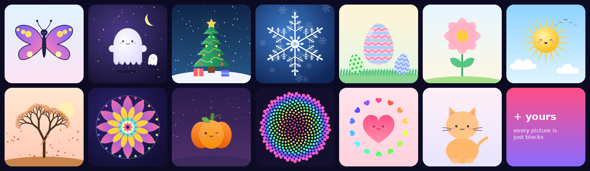

Every picture above is made **only** from simple shapes and repeat rules. Open any of them in the studio and click its parts to see exactly how it was built.

## 🚀 Your first drawing in 60 seconds

1. Open the [**studio**](https://normansrule.github.io/artful-drawing/studio.html) and choose **Draw along → Snowflake**.
2. Read the first step, then either follow it or press **Do this step ✨**.
3. Press **Next →** until the snowflake is finished (three steps, about two minutes).
4. Press **▶ Bloom it** to watch it grow, then **Save PNG**.
5. Change anything: click a part, pick a new color from the palette, or press **Shuffle colors**.

Nothing can break. **Undo** remembers 150 steps, and your drawing saves itself in the browser.

---

## 🔗 Links that open straight into a mode

Share these with anyone. They open the studio ready to go, with no menus to find.

| Link ending | Opens |
|---|---|
| `studio.html#guide=snowflake` | Draw along: `butterfly`, `ghost`, `christmas-tree`, `snowflake`, `easter-eggs`, `flower`, `cat` |
| `studio.html#color=pumpkin` | A coloring page of any of the 13 pictures, with the bucket ready |
| `studio.html#start=pen` | A night canvas with the kaleidoscope pen switched on |
| `studio.html#template=mandala` | A finished picture, blooming into place |

## 🧰 The toolbox

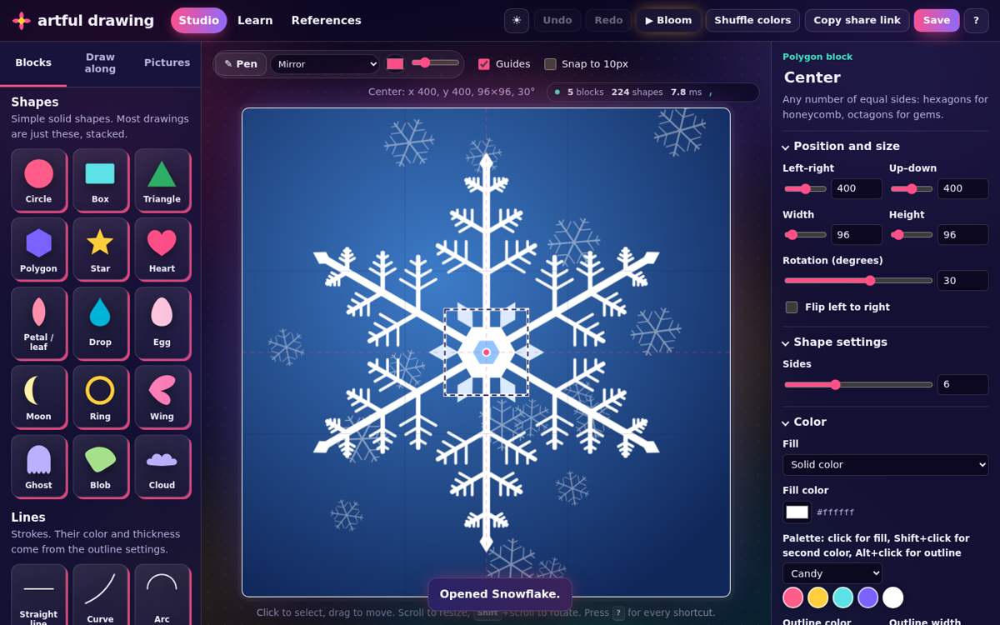

| Tool | What it does |
|---|---|
| **Tool bar** | Select (`V`), Pen (`P`), Eraser (`E`), Color picker (`I`) and Fill (`K`) down the left of the canvas, with each tool's options in a bar on top, like a professional paint program |
| **Effects** | Glow, sticker edge, drop shadow, long shadow and soft focus on any part |
| **Zoom** | Pinch, `Ctrl`+scroll or the − 100% + buttons; `Space`+drag to pan; `Ctrl+0` to fit |
| **Text** | Six lettering styles, several lines, sticker outlines, stretch to fit; repeats and effects work too |
| **Smart guides** | Pink lines while dragging; parts snap to each other's edges and middles and to the page center (`Alt` to drag freely) |
| **Groups** | `Ctrl+G` groups selected parts so they always move together; `Ctrl+Shift+G` ungroups, `Alt`+click picks one part |
| **Add shading** | One click: shadow, highlight and crisp outline, clipped inside and grouped |
| **Tour** | A one-minute spotlight tour of the studio (welcome screen, or the ? help) |
| **Helper** | Friendly tips with one-click fixes and hover previews, based on composition, contrast, color and cuteness |
| **Recolor all** | One color plus a harmony recolors the whole drawing, keeping lights and darks |
| **History** | A named list of every step; click one to jump back or forward |
| **Select several** | Box-select, `Shift`+click or `Ctrl+A`; move, duplicate, delete and align together |
| **Canvas shape** | Square, poster, card, landscape, desktop or phone wallpaper |
| **Symmetry guides** | While the pen is out, dashed lines show where every stroke will be mirrored or spun |
| **Snap shapes** | Hold still at the end of a stroke: rough circles, ovals, rectangles, triangles, polygons, stars and lines become clean, editable shapes |
| **Brushes** | Brush (tapered, pressure-sensitive), ink, marker, pencil, neon and dots |
| **Steady hand** | Smooths out wobbles while you draw; 0 is off, 1 is very smooth |
| **Eraser** (`E`) | Rub over what you drew to remove it (or switch it to erase anything) |
| **Paint bucket** (`K`) | Click any part to fill it with the current color; click the paper to color the background |
| **Coloring pages** | Any of the 13 pictures as white shapes with clean outlines, ready to fill |
| **Trace a photo** | A see-through photo over the canvas to draw on top of, kept out of every export |
| **Pen** (`P`) | Freehand drawing, smoothed automatically. Symmetry: none, mirror, spin × 4 or × 6, or kaleidoscope × 6, × 8 or × 12. Loops fill with color. |
| **Shapes** | Circle, box, triangle, polygon, star, heart, petal, drop, egg, moon, ring, wing, ghost, blob, cloud |
| **Lines** | Straight, curve, arc, wave, zigzag, spiral, and your own pen strokes |
| **Living algorithms** | Fractal tree, snowflake arm, Koch snowflake, Sierpinski triangle, sunflower seed spiral, sunburst, pattern filler |
| **Characters** | A cute face with six expressions, and Text for words |
| **Draw along** | Seven guided drawings: butterfly, ghost, Christmas tree, snowflake, Easter eggs, flower, kitty |
| **Bloom** (`B`) | Watch a picture assemble itself, then download it as a video |

### Repeat rules: one shape becomes many

| Rule | One shape becomes… | Great for |
|---|---|---|
| **Mirror** | a matching pair, flipped | butterflies, faces, leaves |
| **Spin around** | a ring of copies (Kaleidoscope also mirrors every other one) | flowers, mandalas, snowflakes |
| **Step and repeat** | a trail that moves, turns and shrinks a little each time | trees, spirals, tunnels |
| **Grid** | rows and columns (Brick offset for honeycombs) | wallpaper, patterns |
| **Scatter** | a random sprinkle you can reshuffle with a seed | stars, snow, confetti |
| **Golden spiral** | seeds turned 137.5° apart, like a sunflower | sunflowers, galaxies |

Rules **stack**: each one repeats everything above it. Spin a stepped trail and a line of dots becomes ten rays.

### Color that looks good by default

Solid, gradient or glow fills, **8 curated palettes**, a *color shift per copy* for instant rainbows, and **Shuffle colors** to recolor the whole picture in one click.

### Save and share

| Save as | For |
|---|---|
| **PNG picture** | posting, printing, messaging (saved at twice the canvas size) |
| **Sticker PNG** | the same picture with a see-through background |
| **SVG vector** | Inkscape, Illustrator, Figma, vinyl cutters and laser engravers |
| **WebM video** | the bloom animation, ready for social posts |
| **Project file** | reopening later with every shape still editable |
| **Share link** | the whole drawing packed into a web address; anyone can open and remix it |

---

## ⌨️ Keyboard and mouse

Everything works with a **keyboard alone**, a **mouse alone**, or both.

| Key | Action | Key | Action |
|---|---|---|---|
| `P` | Pen on or off | `B` | Play the bloom |
| `K` | Paint bucket | `E` | Eraser |
| `V` | Select tool | `Esc` | Back to the Select tool |
| `I` | Color picker (or `Alt`+click) | `Ctrl` + `=` / `-` / `0` | Zoom in, out, fit |
| `Space` + drag | Look around when zoomed in | Pinch / `Ctrl`+scroll | Zoom around the pointer |
| `Shift`+click | Add a part to the selection | `Ctrl+A` | Select every part |
| `Ctrl+G` | Group (`Ctrl+Shift+G` ungroup) | `Alt`+click | Pick one part inside a group |
| Arrow keys | Move 1 pixel (with `Shift`, 10) | `,` / `.` | Previous or next shape |
| `+` / `-` | Grow or shrink | `Esc` | Deselect, stop the pen or bloom |
| `R` / `Shift+R` | Rotate 15° | `Ctrl+Z` / `Ctrl+Shift+Z` | Undo or redo |
| `F` | Flip | `Ctrl+D` | Duplicate |
| `M` | Mirror on or off | `Ctrl+S` | Save project file |
| `[` / `]` | Send backward or bring forward | `G` | Guides on or off |
| `H` | Hide | `?` | Every shortcut |

With a mouse: drag to move, scroll to resize, and hold `Shift` while scrolling to rotate. On a Mac, use `⌘` wherever this says `Ctrl`.

---

## 🌌 The website around it

| Page | What's there |
|---|---|
| **Home** (`index.html`) | Live swirling ink, pictures that draw themselves, a scroll-built butterfly, a **symmetry painter** you can play with, a 3D picture carousel, and keycaps you can press |
| **Studio** (`studio.html`) | The drawing app: pen, paint bucket, draw along, coloring pages, tracing and My drawings. Night theme by default, with a ☀ switch to the light paper theme |
| **Learn** (`learn.html`) | 17 friendly lessons on symmetry, the golden angle, fractals, color, composition and why cute things look cute, with 50 live examples and 4 slider playgrounds |
| **References** (`references.html`) | Free museum collections, nature photography, pattern books, color tools, drawing courses and the projects that inspired this one |

<table>
<tr>
<td width="50%">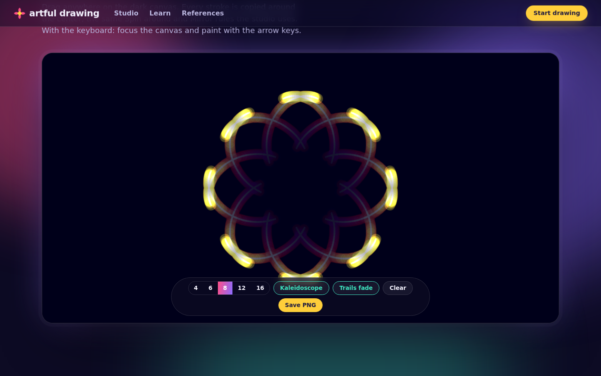</td>
<td width="50%">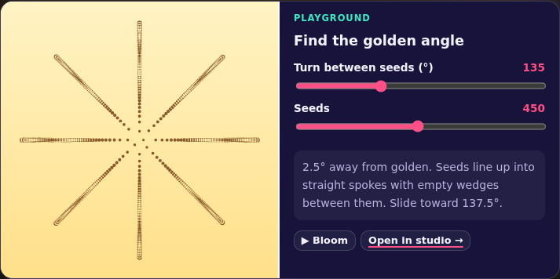</td>
</tr>
</table>

---

## 🛠 Put it online from an Ubuntu terminal

These commands take a fresh Ubuntu terminal (including Windows Subsystem for Linux, WSL) to a live website.

```bash
# 1. Tools: Git, Node.js and the GitHub command-line interface (CLI)
sudo apt update && sudo apt install -y git curl unzip nodejs
(type -p gh >/dev/null) || {
  sudo mkdir -p -m 755 /etc/apt/keyrings
  curl -fsSL https://cli.github.com/packages/githubcli-archive-keyring.gpg | sudo tee /etc/apt/keyrings/githubcli-archive-keyring.gpg >/dev/null
  sudo chmod go+r /etc/apt/keyrings/githubcli-archive-keyring.gpg
  echo "deb [arch=$(dpkg --print-architecture) signed-by=/etc/apt/keyrings/githubcli-archive-keyring.gpg] https://cli.github.com/packages stable main" | sudo tee /etc/apt/sources.list.d/github-cli.list >/dev/null
  sudo apt update && sudo apt install -y gh
}

# 2. Sign in (once per machine)
git config --global user.name  "Your Name"
git config --global user.email "you@example.com"
gh auth login --hostname github.com --git-protocol ssh --web

# 3. Unzip, test and preview (open http://localhost:8000, Ctrl+C to stop)
mkdir -p ~/projects && cd ~/projects
unzip -o /path/to/artful-drawing.zip && cd artful-drawing
npm test
python3 -m http.server 8000

# 4. Create the repository, push, and turn on GitHub Pages in one go
GH_OWNER=your-github-name bash scripts/publish.sh
```

`scripts/publish.sh` runs the tests and fills your username into this README. It then creates the repository, pushes over Secure Shell (SSH), turns on GitHub Pages and waits for the first build. Options:

| Option | Default | Use |
|---|---|---|
| `REPO` | `artful-drawing` | a different repository name |
| `SSH_HOST` | `github.com` | an SSH alias from `~/.ssh/config`, for a second GitHub account |
| `VISIBILITY` | `public` | `private` (GitHub Pages on private repositories needs a paid plan) |

After that, every update is `git add -A && git commit -m "…" && git push`.

**Updating from a new release zip** (keeps your Git history):

```bash
ZIP=$(ls -t ~/Downloads/artful-drawing*.zip | head -1)   # on WSL: /mnt/c/Users/<you>/Downloads
rm -rf /tmp/ad-new && mkdir /tmp/ad-new && unzip -q "$ZIP" -d /tmp/ad-new \
  && cp -a /tmp/ad-new/artful-drawing/. ~/projects/artful-drawing/ \
  && cd ~/projects/artful-drawing && npm test \
  && git add -A && git commit -m "Update artful drawing" && git push
```

If `python3 -m http.server 8000` says *Address already in use*, a preview is already running: open http://localhost:8000, use another port (`python3 -m http.server 8001`), or stop the old one with `fuser -k 8000/tcp`.

<details>
<summary><b>Prefer clicking? Turn on GitHub Pages by hand</b></summary>

1. Push this folder to the `main` branch of a new repository.
2. Open **Settings → Pages**.
3. Under **Build and deployment**, choose **Deploy from a branch**. Pick `main`, then the `/ (root)` folder, and press **Save**.
4. After about a minute the site is live at `https://<your-username>.github.io/<repository-name>/`.

</details>

---

## 🔬 How it works

A drawing is plain JavaScript Object Notation (JSON): a background and a list of shapes, each with a position, size, color and a stack of repeat rules. One pure renderer turns that list into Scalable Vector Graphics (SVG). The same renderer powers the studio, every thumbnail, the Learn page, the video export and the tests.

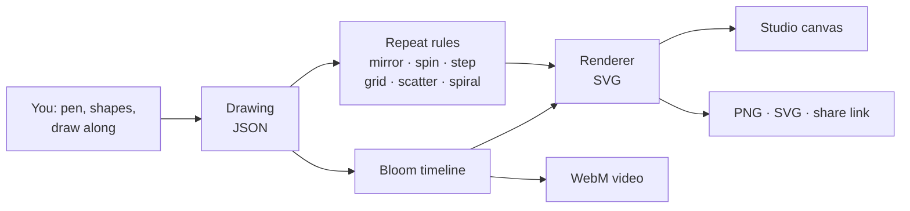

- **No build step, no framework, no runtime dependencies.** The files you see are the files the browser runs.
- **Layer effects** are Scalable Vector Graphics (SVG) filters (blur, morphology, offset and merge), so they stay sharp at any zoom and export with the picture.
- **Shape snapping** fits an ellipse through the stroke using principal component analysis (PCA), finds corners with Ramer-Douglas-Peucker simplification, and keeps whichever fits better. Scribbles and curves fit neither, so they are left alone.
- **Pen strokes** are smoothed with Catmull-Rom splines, and extra points are dropped with the Ramer-Douglas-Peucker algorithm. Each stroke is stored as normalized points, so it stays editable and resizable like any other shape.
- **Randomness is seeded:** the same seed always gives the same sprinkle, so a share link reproduces a drawing exactly.
- **Bloom** treats animation as a pure function of time, so the preview, the video and the home page all show the same motion.

The math, from symmetry groups to the golden angle and fractal dimensions, is explained in [`docs/ALGORITHMS.md`](docs/ALGORITHMS.md).

<details>
<summary><b>Project layout</b></summary>

```
index.html  studio.html  learn.html  references.html
css/
  style.css      layout and design tokens      night.css    Night theme (default)
  effects.css    motion layer, pen, guides     home.css     home page
js/
  shapes.js      every shape: settings + geometry (including the pen stroke)
  repeaters.js   the six repeat rules and how they stack
  recipes.js     the seven draw-along guides
  coloring.js    coloring pages and the paint bucket
  assist.js      drawing helpers: steady hand, pressure, shape snapping
  critique.js    the Helper: tips and one-click fixes
  model.js       the drawing format and repair of broken files
  render.js      drawing → SVG (pure functions, also used by the tests)
  bloom.js       the bloom timeline and video export
  studio.js      the studio: shelf, pen, bucket, draw along, tracing, my drawings, inspector, layers, keyboard
  home.js  toys.js  fluid.js  fx.js  theme.js  learn.js  templates.js
  share.js  color.js  util.js
vendor/gsap/     GreenSock Animation Platform (GSAP), home page only
scripts/         publish.sh (repository + Pages), check-links.sh
docs/            ALGORITHMS.md, CONTRIBUTING.md, DESIGN.md, screenshots, media
tests/           Node test suite (npm test)
```

</details>

## 🧪 Tests

```bash
npm test    # Node.js 18 or newer, nothing to install
```

25 tests cover the following, and GitHub Actions runs them on every push:

- every shape at the edges of every slider
- every repeat rule on every shape
- all 13 pictures and every Learn page example
- every draw-along guide (each step must add real shapes, and every shape must be covered exactly once)
- every coloring page (it must start white with outlines, and the bucket must fill it)
- pen strokes and all six brushes
- shape snapping (rough circles, ovals, boxes, triangles, polygons and lines snap; curves, hearts and scribbles never do)
- the steady-hand stabilizer
- every layer effect on shapes, lines and pen strokes
- color harmonies (every picture, every harmony, and no light or dark ever moves)
- every canvas shape (the drawing stays centered and the size survives saving)
- one-click shading on every round shape (clipped, grouped, never stacking twice)
- text in every lettering style, including awkward characters like `<`, `&` and quotes
- the Helper (every tip on every picture draws cleanly, and each fix actually solves the problem it points out)
- repair of broken project files
- share links that round-trip exactly
- the bloom timeline

## ♿ Accessibility

- Everything works with a keyboard alone, with visible focus outlines everywhere.
- Body text uses Atkinson Hyperlegible, a typeface designed by the Braille Institute for low-vision readers.
- Actions are announced to screen readers.
- Every slider has a number box for exact values.
- With your system set to reduce motion, decorative animation stops and the ink simulation never starts. Every page is complete without motion.

## 🤝 Contributing

Adding a shape, a repeat rule, a picture or a draw-along guide usually takes one small object in one file. [`docs/CONTRIBUTING.md`](docs/CONTRIBUTING.md) walks through each, and [`docs/DESIGN.md`](docs/DESIGN.md) explains the look and the motion principles.

## 🙏 Credits and licenses

artful drawing is released under the [MIT License](LICENSE).

- **GreenSock Animation Platform (GSAP)** 3.15.0 in `vendor/gsap/` is used under GreenSock's free [Standard License](https://gsap.com/standard-license), which is separate from MIT.
- **`js/fluid.js`** is adapted from [WebGL Fluid Simulation](https://github.com/PavelDoGreat/WebGL-Fluid-Simulation) by Pavel Dobryakov (MIT).
- **Motion ideas** come from [React Bits](https://github.com/DavidHDev/react-bits), [Magic UI](https://github.com/magicuidesign/magicui), [Animate UI](https://animate-ui.com/) and [Motion Primitives](https://github.com/ibelick/motion-primitives).
- **Explaining by showing** is inspired by [LLM Visualization](https://github.com/bbycroft/llm-viz) and [Transformer Explainer](https://github.com/poloclub/transformer-explainer).
- **Animation as a function of time** comes from [Remotion](https://github.com/remotion-dev/remotion).
- **Heads-up-display (HUD) styling** is inspired by [God's Eye View](https://github.com/bilawalsidhu/gods-eye-view) and [World Monitor](https://github.com/koala73/worldmonitor).
- **Playfulness** comes from [Bruno Simon's folio](https://github.com/brunosimon/folio-2019).
- **Fonts:** Bricolage Grotesque and Atkinson Hyperlegible, from Google Fonts.

<div align="center">

**[✏️ Start drawing →](https://normansrule.github.io/artful-drawing/studio.html)**

</div>
