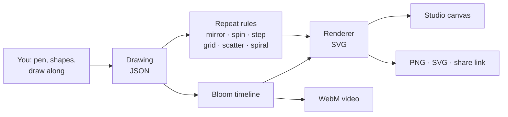

<div align="center">


# artful-drawing

### drawing is easier than you think.

A free drawing studio that runs in your browser. Follow a guided drawing step by step,<br>
doodle with a pen that draws in perfect symmetry, or build anything from simple shapes.<br>
**No drawing skills, no sign-up, nothing to install.** Just a keyboard and a mouse.

[**✏️ Start drawing**](https://N0rmansrule.github.io/artful-drawing/studio.html) ·
[**🦋 Draw along**](https://N0rmansrule.github.io/artful-drawing/studio.html#guide=butterfly) ·
[**✨ Doodle with the pen**](https://N0rmansrule.github.io/artful-drawing/studio.html#start=pen) ·
[**🏠 Website**](https://N0rmansrule.github.io/artful-drawing/) ·
[**📖 Learn**](https://N0rmansrule.github.io/artful-drawing/learn.html)

[](https://github.com/N0rmansrule/artful-drawing/actions/workflows/test.yml)


</div>

---

## ✏️ Three easy ways to draw

<table>
<tr>
<td width="33%" valign="top">

### 1 · Draw along


Pick one of **7 guided drawings**. A faint copy of the finished picture sits on the canvas like tracing paper. Each step tells you what to do, and a **Do this step ✨** button does it for you if you get stuck.

</td>
<td width="33%" valign="top">

### 2 · Doodle with the pen


Press **P** and draw. Every line is mirrored or spun up to 12 ways. Close a loop and it fills with color. Wobbly hands come out smooth, and every stroke stays editable.

</td>
<td width="33%" valign="top">

### 3 · Build with shapes


Stack **29 shapes**, then add a rule: mirror, spin, step, grid, scatter or spiral. Press **Bloom** to watch any picture build itself, and save it as a video.

</td>
</tr>
</table>

## 🖼 What people draw with it


Every picture above is made **only** from simple shapes and repeat rules. Open any of them in the studio and click its parts to see exactly how it was built.

## 🚀 Your first drawing in 60 seconds

1. Open the [**studio**](https://N0rmansrule.github.io/artful-drawing/studio.html) and choose **Draw along → Snowflake**.
2. Read the first step, then either follow it or press **Do this step ✨**.
3. Press **Next →** until the snowflake is finished (three steps, about two minutes).
4. Press **▶ Bloom it** to watch it grow, then **Save PNG**.
5. Change anything: click a part, pick a new color from the palette, or press **Shuffle colors**.

Nothing can break. **Undo** remembers 150 steps, and your drawing saves itself in the browser.

---

## 🧰 The toolbox


| Tool | What it does |
|---|---|
| **Pen** (`P`) | Freehand drawing, smoothed automatically. Symmetry: none, mirror, spin × 4 or × 6, or kaleidoscope × 6, × 8 or × 12. Loops fill with color. |
| **Shapes** | Circle, box, triangle, polygon, star, heart, petal, drop, egg, moon, ring, wing, ghost, blob, cloud |
| **Lines** | Straight, curve, arc, wave, zigzag, spiral, and your own pen strokes |
| **Living algorithms** | Fractal tree, snowflake arm, Koch snowflake, Sierpinski triangle, sunflower seed spiral, sunburst, pattern filler |
| **Characters** | A cute face with six expressions: drop it on any shape to bring it to life |
| **Draw along** | Seven guided drawings: butterfly, ghost, Christmas tree, snowflake, Easter eggs, flower, kitty |
| **Bloom** (`B`) | Watch a picture assemble itself, then download it as a video |

### Repeat rules: one shape becomes many

| Rule | One shape becomes… | Great for |
|---|---|---|
| **Mirror** | a matching pair, flipped | butterflies, faces, leaves |
| **Spin around** | a ring of copies (Kaleidoscope also mirrors every other one) | flowers, mandalas, snowflakes |
| **Step and repeat** | a trail that moves, turns and shrinks a little each time | trees, spirals, tunnels |
| **Grid** | rows and columns (Brick offset for honeycombs) | wallpaper, patterns |
| **Scatter** | a random sprinkle you can reshuffle with a seed | stars, snow, confetti |
| **Golden spiral** | seeds turned 137.5° apart, like a sunflower | sunflowers, galaxies |

Rules **stack**: each one repeats everything above it. Spin a stepped trail and a line of dots becomes ten rays.

### Color that looks good by default

Solid, gradient or glow fills, **8 curated palettes**, a *color shift per copy* for instant rainbows, and **Shuffle colors** to recolor the whole picture in one click.

### Save and share

| Save as | For |
|---|---|
| **PNG picture** | posting, printing, messaging (saved at twice the canvas size) |
| **SVG vector** | Inkscape, Illustrator, Figma, vinyl cutters and laser engravers |
| **WebM video** | the bloom animation, ready for social posts |
| **Project file** | reopening later with every shape still editable |
| **Share link** | the whole drawing packed into a web address; anyone can open and remix it |

---

## ⌨️ Keyboard and mouse

Everything works with a **keyboard alone**, a **mouse alone**, or both.

| Key | Action | Key | Action |
|---|---|---|---|
| `P` | Pen on or off | `B` | Play the bloom |
| Arrow keys | Move 1 pixel (with `Shift`, 10) | `,` / `.` | Previous or next shape |
| `+` / `-` | Grow or shrink | `Esc` | Deselect, stop the pen or bloom |
| `R` / `Shift+R` | Rotate 15° | `Ctrl+Z` / `Ctrl+Shift+Z` | Undo or redo |
| `F` | Flip | `Ctrl+D` | Duplicate |
| `M` | Mirror on or off | `Ctrl+S` | Save project file |
| `[` / `]` | Send backward or bring forward | `G` | Guides on or off |
| `H` | Hide | `?` | Every shortcut |

With a mouse: drag to move, scroll to resize, and hold `Shift` while scrolling to rotate. On a Mac, use `⌘` wherever this says `Ctrl`.

---

## 🌌 The website around it

| Page | What's there |
|---|---|
| **Home** (`index.html`) | Live swirling ink, pictures that draw themselves, a scroll-built butterfly, a **symmetry painter** you can play with, a 3D picture carousel, and keycaps you can press |
| **Studio** (`studio.html`) | The drawing app. Night theme by default, with a ☀ switch to the light paper theme |
| **Learn** (`learn.html`) | 17 friendly lessons on symmetry, the golden angle, fractals, color, composition and why cute things look cute, with 50 live examples and 4 slider playgrounds |
| **References** (`references.html`) | Free museum collections, nature photography, pattern books, color tools, drawing courses and the projects that inspired this one |

<table>
<tr>
<td width="50%"></td>
<td width="50%"></td>
</tr>
</table>

---

## 🛠 Put it online from an Ubuntu terminal

These commands take a fresh Ubuntu terminal (including Windows Subsystem for Linux, WSL) to a live website.

```bash
# 1. Tools: Git, Node.js and the GitHub command-line interface (CLI)
sudo apt update && sudo apt install -y git curl unzip nodejs
(type -p gh >/dev/null) || {
  sudo mkdir -p -m 755 /etc/apt/keyrings
  curl -fsSL https://cli.github.com/packages/githubcli-archive-keyring.gpg | sudo tee /etc/apt/keyrings/githubcli-archive-keyring.gpg >/dev/null
  sudo chmod go+r /etc/apt/keyrings/githubcli-archive-keyring.gpg
  echo "deb [arch=$(dpkg --print-architecture) signed-by=/etc/apt/keyrings/githubcli-archive-keyring.gpg] https://cli.github.com/packages stable main" | sudo tee /etc/apt/sources.list.d/github-cli.list >/dev/null
  sudo apt update && sudo apt install -y gh
}

# 2. Sign in (once per machine)
git config --global user.name  "Your Name"
git config --global user.email "you@example.com"
gh auth login --hostname github.com --git-protocol ssh --web

# 3. Unzip, test and preview (open http://localhost:8000, Ctrl+C to stop)
mkdir -p ~/projects && cd ~/projects
unzip -o /path/to/artful-drawing.zip && cd artful-drawing
npm test
python3 -m http.server 8000

# 4. Create the repository, push, and turn on GitHub Pages in one go
GH_OWNER=your-github-name bash scripts/publish.sh
```

`scripts/publish.sh` runs the tests and fills your username into this README. It then creates the repository, pushes over Secure Shell (SSH), turns on GitHub Pages and waits for the first build. Options:

| Option | Default | Use |
|---|---|---|
| `REPO` | `artful-drawing` | a different repository name |
| `SSH_HOST` | `github.com` | an SSH alias from `~/.ssh/config`, for a second GitHub account |
| `VISIBILITY` | `public` | `private` (GitHub Pages on private repositories needs a paid plan) |

After that, every update is `git add -A && git commit -m "…" && git push`.

<details>
<summary><b>Prefer clicking? Turn on GitHub Pages by hand</b></summary>

1. Push this folder to the `main` branch of a new repository.
2. Open **Settings → Pages**.
3. Under **Build and deployment**, choose **Deploy from a branch**. Pick `main`, then the `/ (root)` folder, and press **Save**.
4. After about a minute the site is live at `https://<your-username>.github.io/<repository-name>/`.

</details>

---

## 🔬 How it works

A drawing is plain JavaScript Object Notation (JSON): a background and a list of shapes, each with a position, size, color and a stack of repeat rules. One pure renderer turns that list into Scalable Vector Graphics (SVG). The same renderer powers the studio, every thumbnail, the Learn page, the video export and the tests.



- **No build step, no framework, no runtime dependencies.** The files you see are the files the browser runs.
- **Pen strokes** are smoothed with Catmull-Rom splines, and extra points are dropped with the Ramer-Douglas-Peucker algorithm. Each stroke is stored as normalized points, so it stays editable and resizable like any other shape.
- **Randomness is seeded:** the same seed always gives the same sprinkle, so a share link reproduces a drawing exactly.
- **Bloom** treats animation as a pure function of time, so the preview, the video and the home page all show the same motion.

The math, from symmetry groups to the golden angle and fractal dimensions, is explained in [`docs/ALGORITHMS.md`](docs/ALGORITHMS.md).

<details>
<summary><b>Project layout</b></summary>

```
index.html  studio.html  learn.html  references.html
css/
  style.css      layout and design tokens      night.css    Night theme (default)
  effects.css    motion layer, pen, guides     home.css     home page
js/
  shapes.js      every shape: settings + geometry (including the pen stroke)
  repeaters.js   the six repeat rules and how they stack
  recipes.js     the seven draw-along guides
  model.js       the drawing format and repair of broken files
  render.js      drawing → SVG (pure functions, also used by the tests)
  bloom.js       the bloom timeline and video export
  studio.js      the studio: shelf, pen, draw along, inspector, layers, keyboard
  home.js  toys.js  fluid.js  fx.js  theme.js  learn.js  templates.js
  share.js  color.js  util.js
vendor/gsap/     GreenSock Animation Platform (GSAP), home page only
scripts/         publish.sh (repository + Pages), check-links.sh
docs/            ALGORITHMS.md, CONTRIBUTING.md, DESIGN.md, screenshots, media
tests/           Node test suite (npm test)
```

</details>

## 🧪 Tests

```bash
npm test    # Node.js 18 or newer, nothing to install
```

12 tests cover the following, and GitHub Actions runs them on every push:

- every shape at the edges of every slider
- every repeat rule on every shape
- all 13 pictures and every Learn page example
- every draw-along guide (each step must add real shapes, and every shape must be covered exactly once)
- pen strokes
- repair of broken project files
- share links that round-trip exactly
- the bloom timeline

## ♿ Accessibility

- Everything works with a keyboard alone, with visible focus outlines everywhere.
- Body text uses Atkinson Hyperlegible, a typeface designed by the Braille Institute for low-vision readers.
- Actions are announced to screen readers.
- Every slider has a number box for exact values.
- With your system set to reduce motion, decorative animation stops and the ink simulation never starts. Every page is complete without motion.

## 🤝 Contributing

Adding a shape, a repeat rule, a picture or a draw-along guide usually takes one small object in one file. [`docs/CONTRIBUTING.md`](docs/CONTRIBUTING.md) walks through each, and [`docs/DESIGN.md`](docs/DESIGN.md) explains the look and the motion principles.

## 🙏 Credits and licenses

artful drawing is released under the [MIT License](LICENSE).

- **GreenSock Animation Platform (GSAP)** 3.15.0 in `vendor/gsap/` is used under GreenSock's free [Standard License](https://gsap.com/standard-license), which is separate from MIT.
- **`js/fluid.js`** is adapted from [WebGL Fluid Simulation](https://github.com/PavelDoGreat/WebGL-Fluid-Simulation) by Pavel Dobryakov (MIT).
- **Motion ideas** come from [React Bits](https://github.com/DavidHDev/react-bits), [Magic UI](https://github.com/magicuidesign/magicui), [Animate UI](https://animate-ui.com/) and [Motion Primitives](https://github.com/ibelick/motion-primitives).
- **Explaining by showing** is inspired by [LLM Visualization](https://github.com/bbycroft/llm-viz) and [Transformer Explainer](https://github.com/poloclub/transformer-explainer).
- **Animation as a function of time** comes from [Remotion](https://github.com/remotion-dev/remotion).
- **Heads-up-display (HUD) styling** is inspired by [God's Eye View](https://github.com/bilawalsidhu/gods-eye-view) and [World Monitor](https://github.com/koala73/worldmonitor).
- **Playfulness** comes from [Bruno Simon's folio](https://github.com/brunosimon/folio-2019).
- **Fonts:** Bricolage Grotesque and Atkinson Hyperlegible, from Google Fonts.

<div align="center">

**[✏️ Start drawing →](https://N0rmansrule.github.io/artful-drawing/studio.html)**

</div>
